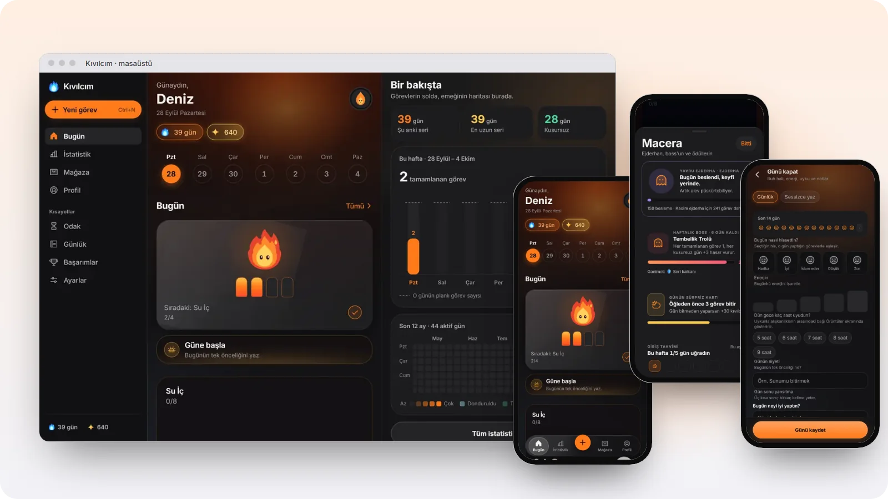

<a href="https://yigit2015.github.io/kivilcim-indir/"><picture>
  <source media="(prefers-color-scheme: dark)" srcset="assets/hero-dark.svg">
  
</picture></a>

Kıvılcım'ı yapıyorum: küçük görevleri alev alev bir seriye dönüştüren bir alışkanlık uygulaması. Hesap istemez, sunucusu yoktur; kayıtlar cihazda kalır. Windows, Mac, Linux ve Android'de çalışıyor; iPhone sürümü yolda.

<a href="https://yigit2015.github.io/kivilcim-indir/#indir"><picture><source media="(prefers-color-scheme: dark)" srcset="assets/btn-indir-dark.png"></picture></a>&nbsp;
<a href="https://yigit2015.github.io/kivilcim-indir/uygulama/"><picture><source media="(prefers-color-scheme: dark)" srcset="assets/btn-web-dark.png"></picture></a>&nbsp;

 

<picture>
  <source media="(prefers-color-scheme: dark)" srcset="assets/showcase-dark.webp">
  
</picture>

## Kıvılcım'ın kuralları

<table>
  <tr>
    <td width="25%" valign="top">
       
      <b>Hesap yok</b> 
      Kayıt, e-posta, sunucu yok. Paylaşım QR ya da kodla, cihazdan cihaza.
    </td>
    <td width="25%" valign="top">
       
      <b>Küçük adım</b> 
      Her gün bir tik alevi büyütür. Seri uzadıkça Kıvı'nın rengi değişir.
    </td>
    <td width="25%" valign="top">
       
      <b>Suçlama yok</b> 
      Seri kırılınca ceza yok; son 30 günün tutarlılığı ve "tekrar hoş geldin".
    </td>
    <td width="25%" valign="top">
       
      <b>Herkes için</b> 
      Ekran okuyucu, sade hareket, renk körü dostu işaretler, büyük yazı.
    </td>
  </tr>
</table>

## Nerede

- **Tanıtım sitesi:** [yigit2015.github.io/kivilcim-indir](https://yigit2015.github.io/kivilcim-indir/)
- **İndirmeler:** [kivilcim-indir](https://github.com/yigit2015/kivilcim-indir) deposunun [Releases](https://github.com/yigit2015/kivilcim-indir/releases) sayfası
- **Sürüm notları:** [her sürümde ne değişti](https://yigit2015.github.io/kivilcim-indir/surumler/)
- **Destek:** [sık sorulanlar](https://yigit2015.github.io/kivilcim-indir/destek/) ya da destekkivilcim@gmail.com

## Nasıl yapılıyor

Uygulama Expo ve React Native ile TypeScript'te yazılıyor; hareketler Reanimated, semboller Phosphor. Masaüstü sürümü Electron kabuğunda aynı kodu çalıştırıyor. Tanıtım sitesi derleme adımı olmayan düz HTML ve CSS; hareketleri GSAP veriyor, dışarıya tek istek atmıyor.
